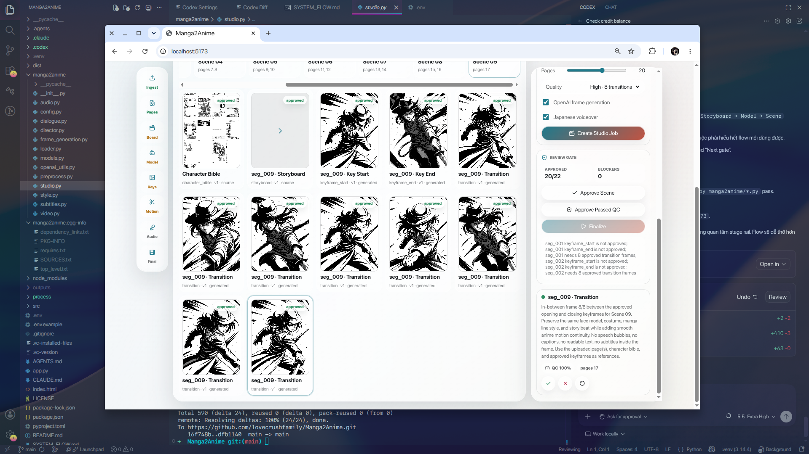

# Manga2Anime

Turn manga pages into a short anime production cut with a real studio workflow: page coverage, character locking, keyframes, transition frames, Japanese voice/subtitle assets, QC, and human approval gates.

<p align="center">
  
</p>

<p align="center">
  <strong>Studio Production Flow v2</strong><br />
  Upload a chapter, generate scene-by-scene, approve every key asset, and render the final cut only when the story coverage and QC gates pass.
</p>

## Why It Feels Like A Studio

- Every uploaded page is mapped into a coverage manifest instead of being silently ignored.
- Each scene gets storyboard review, a character bible, 2 keyframes, and transition frames.
- The GUI shows real generated/source assets with approve, reject, regenerate, and finalize gates.
- Dialogue is removed from frames and moved to Japanese subtitle/voice assets outside the artwork.
- Identity lock prioritizes preserving the manga character over making a pretty-but-wrong frame.

The current v2 flow is a staged production console:

- upload one PDF chapter, ordered page images, or an image folder
- enter a style/directing prompt
- optionally upload `.srt`, `.vtt`, or `.txt` dialogue/subtitle file
- create a studio job
- run each production stage: ingest, page analysis, storyboard, character bible, keyframes, transitions, audio, final cut
- review generated/source assets in the GUI, approve good frames, reject/regenerate bad frames, and only finalize after required approvals pass
- get an MP4 with cleaned frames, no dialogue text in-frame, page coverage, 2 keyframes per scene, transition frames, Japanese subtitle metadata, and optional Japanese voiceover mixed into the final video

The legacy one-click `/api/direct` quick render remains available for fast demos, but the React UI now targets the staged studio workflow.

## MVP Scope

Included:

- 10-20 manga pages from PDF or images
- browser folder upload for `.jpg` / image chapters
- user-controlled style prompt
- optional subtitle/dialogue upload, plus OpenAI vision dialogue extraction when no subtitle is provided
- dialogue/text region removal before rendering
- rough background plate and character ink cutout generation for each page
- motion hints from foreground movement between pages
- OpenAI vision analysis/director plan with studio roles for direction, camera, animation, subtitles, and voice
- all-page page analysis and coverage manifest; uploaded pages are not silently sampled away
- file-backed studio job state in `outputs/{job_id}/production_state.json`
- human approval gates for storyboard, character bible, keyframes, transition frames, subtitle/voice assets, and final cut readiness
- OpenAI Image Generation / image editing for optional keyframes and transition frames, using cleaned manga pages, character cutouts, and approved keyframes as source input
- identity-locked frame generation: character face, hair, outfit, proportions, and manga line style are preserved from the source page; if a generated frame adds too much new character detail, the renderer falls back to the cleaned source frame
- Japanese `.srt` subtitle export outside the anime frame
- optional OpenAI TTS Japanese voiceover and audio muxing into the final MP4
- Python + ffmpeg MP4 rendering
- React + Vite web UI
- FastAPI backend
- black-and-white / line-art output

Not included yet:

- automatic coloring
- background music, foley, or multi-character cast recording
- learning from anime video references
- full chapter-length animation
- production-grade semantic character segmentation or background inpainting

## Setup

Install Python 3.11+, then:

```bash
python3 -m venv .venv
source .venv/bin/activate
pip install -e .
cp .env.example .env
npm install
```

Set `OPENAI_API_KEY` in `.env` or export it in your shell:

```bash
export OPENAI_API_KEY="..."
```

Run the backend:

```bash
source .venv/bin/activate
uvicorn app:app --reload --host 0.0.0.0 --port 8000
```

Run the frontend in a second terminal:

```bash
npm run dev
```

Open `http://localhost:5173`.

System and studio-agent flow diagrams are in [SYSTEM_FLOW.md](SYSTEM_FLOW.md). The active PRD/SPEC and RIPER plan live under `process/features/direct-anime/active/manga2anime-studio-flow_27-06-26/`.

Generated videos and production state are written to `outputs/`. The renderer uses system `ffmpeg` when available and otherwise falls back to the bundled executable provided by `imageio-ffmpeg`.

Per-run preprocessing artifacts are also written under `outputs/{run_id}/layers/`:

- `clean.png` -- dialogue/text regions removed
- `background.png` -- rough cleaned background plate
- `character.png` -- rough transparent character/ink cutout

Studio v2 jobs write assets under `outputs/{job_id}/assets/{segment_id}/`, plus `character_bible/character_bible.png`, Japanese `.srt`, optional voice MP3, and final `.studio.mp4` / `.final.mp4` output.

## Models

Defaults are configurable in `.env.example`:

- `OPENAI_VISION_MODEL=gpt-4o`
- `OPENAI_IMAGE_MODEL=gpt-image-1`
- `OPENAI_TTS_MODEL=gpt-4o-mini-tts`
- `OPENAI_TTS_VOICE=alloy`

If no API key is present, the app still creates a demo MP4 by directing and animating the uploaded manga pages without generated action frames.

## Notes

Use manga pages you own or have rights to transform. If the style prompt names a studio, franchise, or well-known anime, the app translates that request into broad cinematic traits instead of trying to copy an exact protected style.
