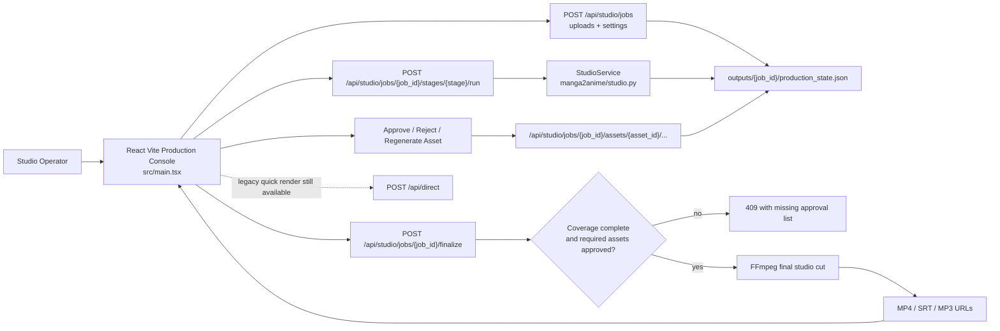
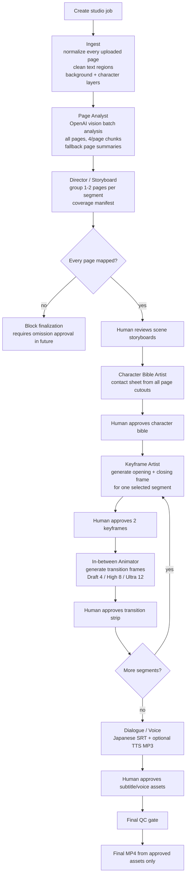
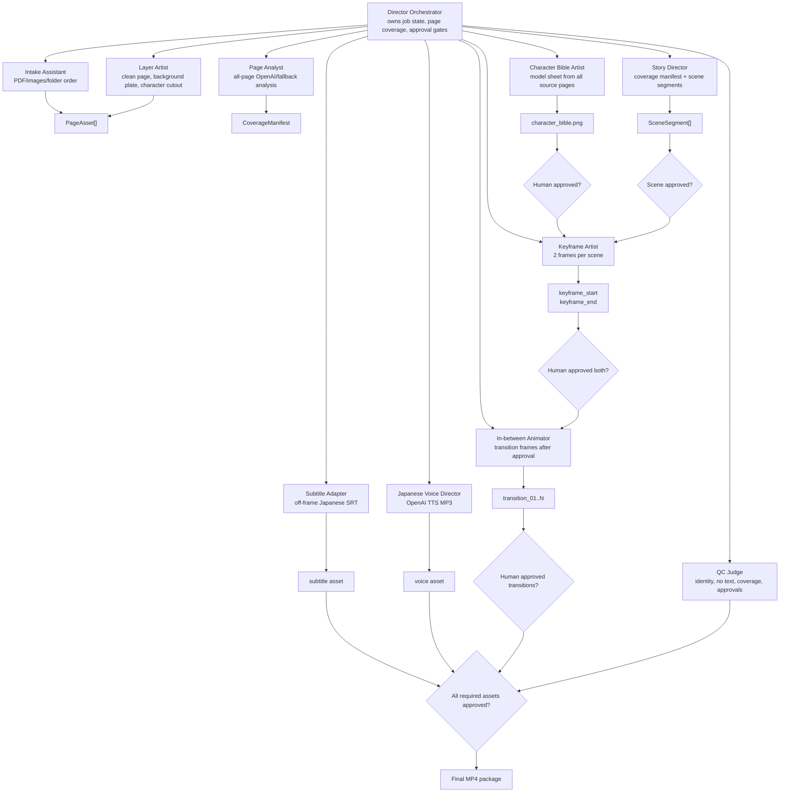
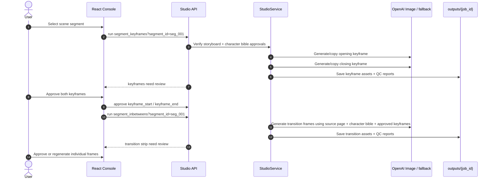
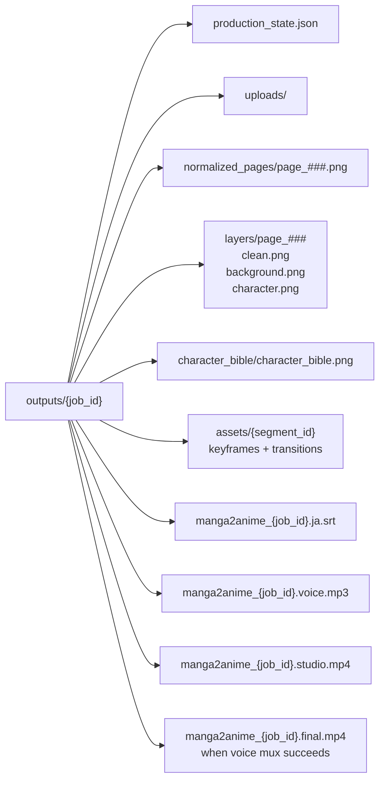

# Manga2Anime Studio Production Flow v2

## 1. Studio Job API Flow

## 2. Human-In-The-Loop Stage Machine

## 3. Multi-Agent Studio Runtime

## 4. Segment Generation Loop

## 5. Output Package

